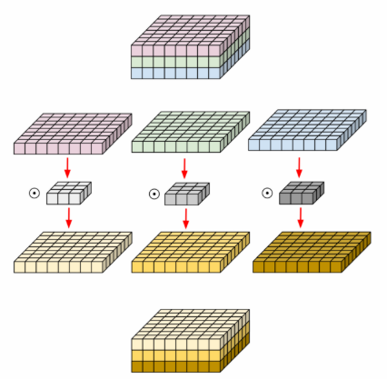

CNN에서의 연산량을 줄이기 위해서 고안된 convolution 기법들이다.

> CNN의 parameter가 많을수록 over-fitting이 일어날 가능성이 높다.

### Normal Convolutional computation

* 입력 size: $width_in * height_in * channel_in$
* 출력 size: $width_out * height_out * channel_out$
* kernel size: $width_k * height_k * channel_k$

위와 같은 경우에 convolution 연산량은?

$$ width_k * height_k * channen_in * channel_out * width_in * height_in * width_out * height_out $$

즉, $입력 size * 출력 size * kernel의 height*width$라고 할 수 있다.

> 이 때, depthwise convolution은 위의 channel_in을 multiplication으로서 수행되는게 아닌 addition으로 수행되게끔하여 연산량을 줄이려는 기법이다. 

### Depthwise convolution



간략하게는 위의 그림에서처럼 H * W * C의 입력에 대해서 C단위로 분리(C개의 H * W * 1)를 하고, 이의 각각에 대해여 convolution filter를 적용하여 계산한 출력을 모두 합치는 과정이다. 

> 이 때, 각 필터에 대한 연산 결과는 다른 필터로부터 독립적일 경우에 장점이 된다. 

```python

class depthwise_conv(nn.Module):
    def __init__(self, num_channels_in, num_channels_out):
        super(depthwise_conv, self).__init__()
        self.depthwise = nn.Conv2d(num_channels_in, num_channels_in*num_channels_out, kernel_size=3, padding=1, groups=num_channels_in)

    def forward(self, x):
        out = self.depthwise(x)

        return out
```
직관적으로 알 수 있듯, 하나의 레이어에서 몇개의 아웃풋을 만들 것이냐는 말로 귀결된다.

> num_channels_out은 filter의 갯수를 의미하기도 한다.

아무래도 구현의 핵심은 `groups=num_channels_in`으로, 이는 input을 `num_channels_in`개의 서로 다른 `group`으로 만들어서 해당 연산을 수행하겠다는 뜻이 된다. (group의 default는 1이다.)

### Pointwise convolution

1x1 convolution이다.

```python
class pointwise_conv(nn.Module):
    def __init__(self, num_channels_in, num_channels_out):
        super(pointwise_conv, self).__init__()
        self.pointwise = nn.conv2d(num_channels_in, num_channels_out, kernel_size=1)

    def forward(self, x):
        out = self.pointwise(x)

        return out
```

### Depthwise separable convolution


위의 그림처럼 depthwise conv.를 수행하고, pointwise conv를 차례로 수행한다. 이를 통해서 3x3의 필터를 통해 conv 연산도 진행하고, 서로 다른 channel들의 정보도 공유하면서 동시에 파라미터 수도 줄일 수 있다.

```python
class depthwise_separable_conv(nn.Module):
    def __init__(self, nin, kernels_per_layer, nout):
        super(depthwise_separable_conv, self).__init__()
        self.depthwise = nn.Conv2d(nin, nin * kernels_per_layer, kernel_size=3, padding=1, groups=nin)
        self.pointwise = nn.Conv2d(nin * kernels_per_layer, nout, kernel_size=1)

    def forward(self, x):
        out = self.depthwise(x)
        out = self.pointwise(out)
        return out
```