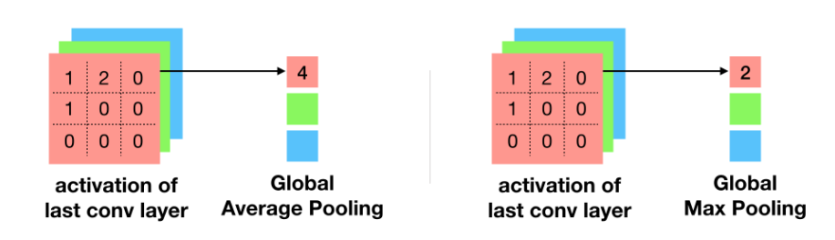

## Pooling이란

pooling은 sub sampling과 같은 맥락에서 주어진 image 혹은 feature map의 크기를 줄이는 과정을 의미한다. 크기를 줄이는 방법은 여러 가지가 존재할 수 있다. 특히, 이미지나 feature map은 다차원이고 각각의 차원은 pixel 단위로 나타낼 수 있기 때문에 이를 어떤 방식으로 해석하고자 하느냐에 따라서 여러 방법으로 크기를 변형할 수 있는 것이다. 간단하게 예를 들면, max pooling은 줄이고자 하는 영역의 pixel 중에서 가장 큰 값으로 그 영역을 대표하겠다는 것이다. 이 외에도 average pooling, stochastic pooling, cross channel pooling 등이 존재한다. 

이러한 pooling은 주어진 task를 수행하기 위한 학습을 하는 데에 있어서 필요없는 정보를 생략함으로서 학습하고자 하는 parameter를 줄이는 이점을 얻을 수 있다. 그리고 이렇게 parameter가 줄어들기 때문에 해당 network의 표현력이 줄어들어 overfitting도 제한할 수 있는 것이고, 당연히 computation이 줄어들기 때문에 학습 시간에서 이점을 볼 수 있다. 

> 이 때, 단순한 pooling은 학습 parametmer에 포함되지 않지만, 몇몇 다른 pooling은 학습을 통해서 되는 것도 있다. 

> convolutional layer를 통해서도 pooling과 같은 크기를 줄이는 효과를 얻을 수 있다. 그리고 이 때의 정보손실과 computional load에 대해서 convolutional layer가 pooling을 쓰는 것보다 더 효과적이기 때문에 최근에는 pooling 대신에 convolutional layer를 활용한다. 

### GeM(Generalized Mean Pooling)

### GAP(Global Average Pooling)

출처: https://jsideas.net/class_activation_map/

GAP는 위의 그림과 같이 3차원(height x width x channel)의 이미지 혹은 feature map을 2차원(height*width x channel)으로 줄이는 과정을 의미한다. 이는 기존에 일반적으로 사용되는 구조인 CNN + FC에서 FC를 classifier인 FC를 제거하기 위해 고안된 pooling이라고 한다. 

이는 CNN의 hidden layer를 거칠수록 high-level의 함축된 정보가 feature에 담기게 되고, 이 feature의 각 평균값을 사용하여 분류하는 것이다.
하지만, FC는 전체의 CNN보다 더 많은 parameter를 가지고 있으므로 계산이 오래 걸리고, 입력단(in_feature)의 크기가 고정되어야 한다는 단점이 있다.
그리고 1차원으로 바뀌기 때문에 위치정보가 모두 소실된다.

즉, GAP를 활용하면 입력되는 크기와 관계없이 사용할 수 있다.

### Adaptive Average Pooling

### Max pooling

