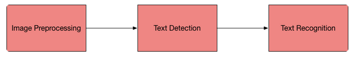

# Optical Charactre Recognition

## Why still challeges in OCR?
There are two cases in OCR: structured text and unstructured text.
* Structured text: text in a typed document, which is proper row ,standard font and mostly dense with a standard background.
* Unstructured text: text at random places in a nuatural scene, which is sparse, no proper row and no standard font in a complex background.

Before the boom of deep learning, most of OCR problem had been considered for structured text and it worked well. However, these techniques did not properly work for unstructured text and this can be solved with deep learning. 

Thus, deep learning based OCR has a crucial role of solving the challenges in OCR problems!!!

## Datasets for unstructured OCR problems
Different datasets present different tasks to be solved. 

### SVHN dataset
The Street View House Numbers dataset contains 73257 digits for training, 26032 digits for testing, and 531131 additional as extra training data. The dataset includes 10 labels which are the digits 0-9. The dataset differs from MNIST since SVHN has images of house numbers with the house numbers against varying backgrounds. The dataset has bounding boxes around each digit instead of having several images of digits like in MNIST.

### Scene Text dataset
This dataset consists of 3000 images in different settings (indoor and outdoor) and lighting conditions (shadow, light and night),  with text in Korean and English. Some images also contain digits.

### Devanagri Character dataset
This dataset provides us with 1800 samples from 36 character classes obtained by 25 different native writers in the devanagri script.

## OCR pipeline (based on deep learning)

### Preprocessing
1. Remove the noise from the image
2. Remove the complex background from the image
3. Handle the different lightning condition in the image

### Text detection
Text detection is required to detect the text and create a bounding box around the text in the image. 

#### Sliding window technique
This creates a bounding box the text with sliding window passing through the image to detect the text in that window, like a convolutional neural network. However, this is a computationally expensive task becuase it requires different window size not to miss the text portion with different size. There is a convolutional implementation of the sliding window which can reduce the computational time.

#### Single Shot and Region based detectors
There are single-shot detection techniques like YOLO(you only look once) and region-based text detection techniques for text detection in the image.

* YOLO is single-shot techniques as you pass the image only once to detect the text in that region, unlike the sliding window.

* Region-based approach work in two steps: First, the network proposes the region which would possibly have the test and then classify the region if it has the text or not. You can refer one of my previous article to understand techniques for object detection, in our case text detection.

#### EAST (Efficient accurate scene text detector)
This is a very robust deep learning method for text detection based on this [paper](https://arxiv.org/abs/1704.03155v2). It is worth mentioning as it is only a text detection method. It can find horizontal and rotated bounding boxes. It can be used in combination with any text recognition method.  

The text detection pipeline in this paper has excluded redundant and intermediate steps and only has two stages. 

One utilizes the fully convolutional network to directly produce word or text-line level prediction. The produced predictions which could be rotated rectangles or quadrangles are further processed through the non-maximum-suppression step to yield the final output.
 
EAST can detect text both in images and in the video. As mentioned in the paper, it runs near real-time at 13FPS on 720p images with high text detection accuracy. Another benefit of this technique is that its implementation is available in OpenCV 3.4.2 and OpenCV 4. We will be seeing this EAST model in action along with text recognition.

### Text Recognition
Once we have detected the bounding boxes having the text, the next step is to recognize text. There are several techniques for recognizing the text. We will be discussing some of the best techniques in the following section.

#### CRNN

Convolutional Recurrent Neural Network (CRNN) is a combination of CNN, RNN, and CTC(Connectionist Temporal Classification) loss for image-based sequence recognition tasks, such as scene text recognition and OCR. The network architecture has been taken from this [paper](https://arxiv.org/abs/1507.05717) published in 2015.

This neural network architecture integrates feature extraction, sequence modeling, and transcription into a unified framework. This model does not need character segmentation. The convolution neural network extracts features from the input image(text detected region). The deep bidirectional recurrent neural network predicts label sequence with some relation between the characters. The transcription layer converts the per-frame made by RNN into a label sequence. There are two modes of transcription, namely the lexicon-free and lexicon-based transcription. In the lexicon-based approach, the highest probable label sequence will be predicted.

## Implementation (with realsense2 camera)

'''
python text_detection_video.py --east frozen_east_text_detection.pb 
'''

## REFERENCE
* (Nanonets)[https://nanonets.com/blog/deep-learning-ocr/]
* (EAST text detector)[https://www.pyimagesearch.com/2018/08/20/opencv-text-detection-east-text-detector/]