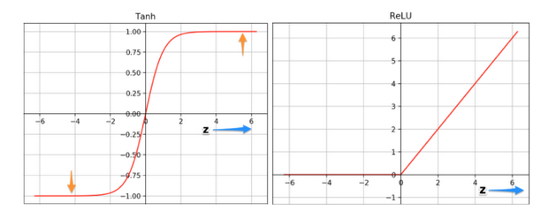
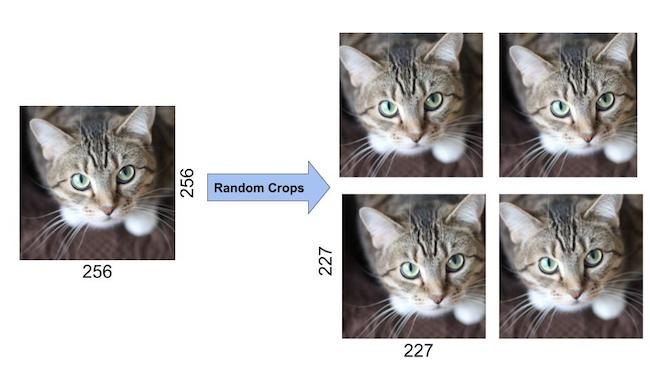
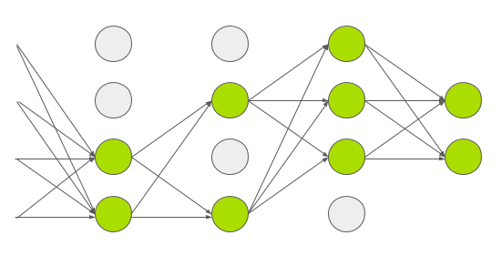

### Alexnet

## Input
It solves the problem of image classification where the input is an image of one of 1000 different classes (e.g. cats, dogs etc.) and the output is a vector of 1000 numbers. The ith element of the output vector is interpreted as the probability that the input image belongs to the ith class.

The input to AlexNet is an RGB image of size 256×256

Random crops of size 227×227 were generated from inside the 256×256 images to feed the first layer of AlexNet. Note that the paper mentions the network inputs to be 224×224, but that is a mistake and the numbers make sense with 227×227 instead.

## Architecture
5 Convolutional Layers and 3 Fully Connected Layers

Multiple Convolutional Kernels (a.k.a filters) extract interesting features in an image. In a single convolutional layer, there are usually many kernels of the same size. For example, the first Conv Layer of AlexNet contains 96 kernels of size 11x11x3. Note the width and height of the kernel are usually the same and the depth is the same as the number of channels.

ReLU nonlinearity is applied after all the convolution and fully connected layers. The ReLU nonlinearity of the first and second convolution layers are followed by a local normalization step before doing pooling. But researchers later didn’t find normalization very useful.

### Overlapping Max Pooling
Max Pooling layers are usually used to downsample the width and height of the tensors, keeping the depth same. Overlapping Max Pool layers are similar to the Max Pool layers, except the adjacent windows over which the max is computed overlap each other.

### ReLU Nonlinearity

Tanh or sigmoid activation functions used to be the usual way to train a neural network model. AlexNet showed that using ReLU nonlinearity, deep CNNs could be trained six times faster than using the saturating activation functions like tanh or sigmoid with CIFAR-10 dataset. 

The tanh function saturates at very high or very low values of z. At these regions, the slope of the function goes very close to zero. This can slow down gradient descent. On the other hand the ReLU function’s slope is not close to zero for higher positive values of z. This helps the optimization to converge faster. For negative values of z, the slope is still zero, but most of the neurons in a neural network usually end up having positive values.

### Reducing Overfitting

#### Data Augmentation
Showing a Neural Net different variation of the same image helps prevent overfitting.

* By Mirroring
we can double the size of the training dataset by simply flipping the image about the vertical axis.

* By Random Crops
The authors of AlexNet extracted random crops of size 227×227 from inside the 256×256 image boundary to use as the network’s inputs. They increased the size of the data by a factor of 2048 using this method.

### Dropout
In dropout, a neuron is dropped from the network with a probability of 0.5. When a neuron is dropped, it does not contribute to either forward or backward propagation. So every input goes through a different network architecture, as shown in the animation below. As a result, the learnt weight parameters are more robust and do not get overfitted easily. During testing, there is no dropout and the whole network is used, but output is scaled by a factor of 0.5 to account for the missed neurons while training. Dropout increases the number of iterations needed to converge by a factor of 2, but without dropout, AlexNet would overfit substantially.

