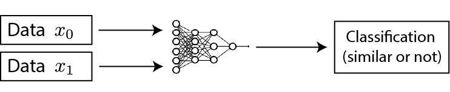
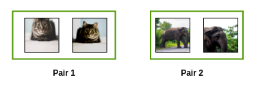

## Contrastive Learning Tutorial

### Contrative Learning이란

Contrastive learning은 self-supervised learning의 하나의 기법이다.

예를 들어서, 사람은 어떠한 환경에서든 어떤 물체를 인식하는 데에 있어서 그 물체를 샅샅히 정확하게 훓어보지 않는다. 그리고 이는 CNN과 같은 representation learning에 빗대어 설명하자면, high-level feature를 기억하고 세세한 pixel-level의 정보들은 사용하지 않는 것과 같다고 할 수 있다. 그리고 pixel-level에 집중하지 않고, high-level feature로만으로 충분히 사물을 구별할 수 있도록 해주는 learning method를 contrastive learning이라고 한다.

위에서와 같이 Contrastive learning은 주어진 데이터들이 비슷한지 아닌지를 파악하는 모델로서, 다른 machine learning model과는 다른 접근법을 가지고 있다. 이를 위한 score function은 다음과 같이 나타난다.
$$ score(f(x), f(x^+)) >> score(f(x), f(x^-)) $$

이 때, $x^+$는 $x$와 매우 유사한 positive sample이고, $x^-$는 $x$와 유사하지 않은 negative sample이라고 한다.

그리고 Google이 개발한 SimCLR은 `softmax classifier`를 활용하여 positive sample과 negative sample을 구분해낸다. 

### SimCLR

본 논문에서 말하는 contrastive learning은 먼저 주어진 unlabeled images에서 generic representation을 배우고, 적은 양의 labelled images로 fine-tune을 한다. 그리고 이러한 generic representation의 학습에 대한 직관적인 원리는 동일하다고 판단이 되는 이미지들을 다른 각도와 형태로부터 score function으로 측정한 비슷한 정도를 최대화하고, 차이를 최소화하기 때문이다. 예를 들어서, 아래와 같ㅣ 각각의 pair에 대해서 pair내의 두 이미지는 서로 비슷하다고 학습이 된다. 

#### References
* [What is Constrative Learning?](https://analyticsindiamag.com/contrastive-learning-self-supervised-ml/)

* [Contrastive Self-Supervised Learning](https://ankeshanand.com/blog/2020/01/26/contrative-self-supervised-learning.html)

* [SimCLR](https://ai.googleblog.com/2020/04/advancing-self-supervised-and-semi.html)

* [The Illustrated SimCLR Framework](https://amitness.com/2020/03/illustrated-simclr/)