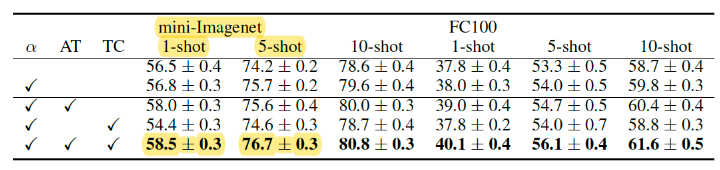

# Few-shot Learning

## Motivation 

일반적으로 딥러닝은 데이터가 많을 수록 더 좋은 성능을 나타내는 경향이 있다. 하지만, 무작정 데이터의 양이 많다고 하기보다는 데이터의 질이 당연히 좋아야 한다(현실을 충분히 잘 반영할 정도로 다양하고 품질이 우수한 데이터)는 걸 기반으로 이야기한다.

하지만, 우리가 하는 일반적인 딥러닝 모델은 어떠한 하나의 객체를 파악하는 데에 있어서도 수백 ~ 수만 장의 데이터가 필요하여 매우 비효율적이다. (인간은 몇 장의 사진으로도 객체를 구분할 수 있다는 것과 비교할 때, 게다가 인간은 처음 보는 객체도 구분이 가능하다.) 이러한 관점을 기반으로 하여 소량의 데이터로 학습을 하는 연구분야가 **Few-shot learning**이다.

## Few-shot learning이란

**Few-shot learning**은 데이터를 다음과 같이 구성한다.

* support data: 학습용
* query data: 테스트용

이러한 **Few-shot learning**의 태스크를 **N-way K-shot problem**라고 하며, `N`은 구분하고자 하는 객체의 종류(class)의 수이고, `K`는 각 class별 support data의 수를 의미한다. 

예를 들어, 자동차와 비행기를 구분하는 태스크에서 각각 10장의 학습용 사진이 주어진다면, 2-way 10-shot problem으로서 **Few-shot learning**을 구성할 수 있다.

그리고 앞서 말했듯이, 딥러닝은 데이터가 많을수록 더 좋은 성능을 나타내는 경향이 있으므로, `K`가 클수록 모델의 성능이 좋아진다고 할 수 있다. 따라서, **Few-shot learning**은 이 `K`가 매우 작은 (일반적인 딥러닝과 비교하여) 상황을 전제로 하여 진행하는 딥러닝의 한 분야라고 할 수 있다. 이와 반대로, `N`이 클수록 분류하고자 하는 객체의 종류가 다양해지므로 당연히 모델의 성능은 반비례한다. 

일반적인 **Few-shot learning**의 benchmark에서는 `N`은 10개 이하이고, `K`는 1개 또는 5개로 설정하여 진행한다. 그리고 query data는 각 class당 15개로 한다. 예를 들어, 다음과 같이 5-way 1-shot problem에서는 모델의 정확도가 50%이고, 5-way 5-shot problem에서는 70% 수준인 것을 아래에서 확인할 수 있다.

### Meta learning

**Few-shot learning**이 새로운 환경에서 

### Trends

#### Metric learning

1. [Siamese Neural network for one-shot image recognition](https://www.cs.cmu.edu/~rsalakhu/papers/oneshot1.pdf)

2. [Matching networks for one-shot learning](https://arxiv.org/pdf/1606.04080.pdf)

3. [Prototypical networks for few-shot learning](https://arxiv.org/pdf/1703.05175.pdf)

4. [Learning to compare : relation network for few-shot learning](https://arxiv.org/pdf/1711.06025.pdf)

#### Graph Neural Networks

## References
* [TADAM: Task dependent adaptive metric for improved few-shot learning](https://arxiv.org/pdf/1805.10123.pdf)

* https://www.kakaobrain.com/blog/106