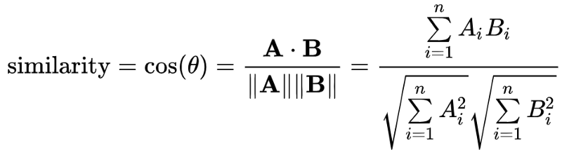
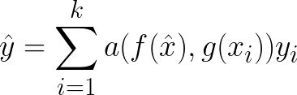

# Few-shot learning

적은 데이터로의 학습으로도 좋은 성능을 내기 위한 연구를 하는 분야로서, 학습 데이터가 적기 때문에 **일반화**가 핵심이라고 할 수 있다.

## 1. Intro.
Computer Vision 분야에서 이에 대한 연구는 사람처럼 적은 데이터로도 물체를 구분할 수 있듯이 모델을 학습시키자는 것이 목적이고, 그만큼 새로운 데이터가 많아지기 대문에 일반화의 성능을 높이는 방향으로 연구가 진행되고 있으며, classification에 대해서 주로 다루어지고 있다.  

이 때, 학습용도로 사용하는 데이터셋을 **support data**라고 하고, 테스트/평가에서 사용하는 데이터셋을 **query data**라고 한다. 이 때, class의 수를 `N`, class에 속하는 이미지의 수를 `K`라고 하여 **N-way K-shot** 문제라고 표현한다. 보통의 딥러닝에서는 `K`가 매우 큰 방데한 데이터를 기반으로 학습을 하지만, **few-shot learning**에서는 `K`가 작은 경우의 학습을 하는 기법을 의미한다. 반대로 `N`은 성능과 반비례의 관계를 갖는다. 그리고 이는 본 few-shot learning에서도 마찬가지로 적용되는 관점이고, 일반적으로 먼저 활발한 연구가 진행되고 있는 image classification 문제에서는 `N`은 10개이하이고 `K`는 1개 또는 5개로 하여 5-Way 1-Shot 또는 5-Way 5-Shot로 benchmark하고 있다. 이 때, query data는 class당 15개가 주로 활용한다고 한다.

> 참고: [TADAM: Task dependent adaptive metric for improved few-shot learning](https://arxiv.org/pdf/1805.10123.pdf)

이를 위한 대표적인 방법론으로는 다음과 같이 2가지가 있다.
* **Data-driven approach**: support set을 다양한 data augmentation 기법으로 데이터의 양을 늘리는 방법이다.
* **Model-based approach**: 주어진 물체의 class를 구분할 수 있도록 모델을 학습시키는 방법

> 이 때, data-driven approach는 support set의 데이터가 데이터의 모집단을 대표한다는 보장이 없기 때문에 명확한 한계가 존재한다.

### Model-based approach

#### Graph neural network

#### Metric-based apporach
이미지 간의 similarity를 기반으로 하여 구분할 수 있도록 모델을 학습시키는 방법이다. 예를 들어, 이미지의 feature vector로 similarity(euclidan distance, cosine similarity, ...)를 계산하여 비슷한 class의 이미지끼리 feature의 영역이 구분되도록 feature를 재배치하는 모델을 학습하는 것이다. 

* Euclidian distance: 

$$ d(p, q) = d(q, p) = \sqrt{\sum_{i=1}^n (q_i - p_i)^2} $$

* Cosine similarity:

> 위와 같이 cosine similarity는 vector의 magnitude와 무관하게 direction의 차이만을 비교하지만, euclidean distance는 magnitude도 같이 고려하여 feature vector에 담겨 있는 값들의 scale에 민감하기 때문에 normalization을 적용하더라도 euclidean distance는 0 ~ 1 사이에서 작은 값보다 큰 값에 더 민감하게 반응한다.

이와 같은 similarity metric을 활용하여 다음과 같이 모델을 구성한다.

위 수식에서 $\hat{x}$는 query set이며, $x_i$ 와 $y_i$는 각각 support set에 속하는 이미지와 one-hot encoding된 레이블을 의미한다. 함수 $f$와 $g$는 feature를 추출하는 함수이고, $a$는 similarity metric을 계산하는 함수이다.즉, 각각의 이미지로부터 feature를 추출하고, 이에 대한 similarity를 전부 계산한 뒤 해당 support set의 레이블에 해당하는 점수만 남겨두었다고 이해할 수 있다.

> 위의 수식을 기반으로 어떻게 feature를 추출할지, 어떤 similarity metric을 사용할지, 어떤 loss function을 사용할지 등 다양한 논문들이 발표되었고, 다음의 논문에서 참조가 가능하다. 
* [A Closer Look at Few-shot Classification](https://arxiv.org/pdf/1904.04232.pdf)

이 때, 학습 데이터를의 class들을 **base class**라고 하고, 테스트 데이터의 class들을 **novel class**라고 하고, 당연히 두 class 집단은 겹치지 서로 겹치지 않는다. 그리고 base class의 데이터를 **source domain**이라고 하고, novel class의 데이터는 **target domain**이라고 한다. 

이 방법론을 적용하여 학습하는 방법에는 다음과 같이 2가지가 존재한다. 

* **Transfer learning**: 간단히는 fine tuning처럼 일반적으로 computer vision에서 이미 많이 사용되고 있는 개념으로, base class의 데이터를 먼저 학습하고 novel class의 support set에 대해서 재학습하는 방법이다.

* **Meta-learning**: Novel Class와 base class에서 각각 특정 클래스 샘플들을 support Set과 query Set으로 구성해 학습과 테스트를 반복하여 적은 데이터의 양으로도 학습이 가능하도록 하는 모델을 학습하는 방법을 배우는 학습법이라고 할 수 있다. 이에 대하여 자세히는 episodic training을 사용하고 있다. 

## 2. By meta learning

Meta-learning이란 사람에 의해서 진행되는 기계학습의 처리 과정을 자동화하는 것을 목적으로 하여 처리 과정 자체의 학습 규칙(meta knowledge)을 학습할 수 있게 하는 방법론이다. 그리고 few-shot learning에서는 episodic training 방식으로 meta-learning을 적용하고, 이러한 episodic traning은 few-shot learning task와 유사한 훈련 과정 통해 모델 스스로 학습 규칙을 도출할 수 있게 하여 **일반화 성능을 높이는 방식이다.** 즉, few-shot learning은 적은 데이터로 학습을 한다는 관점에서 일반화가 매우 잘되어야 하고 이를 meta-learning과 episodic traning 방식으로 수행할 수 있다. 

### Episodic training

일반적인 딥러닝에서는 데이터를 training/validation/test(evaluation)의 3가지 데이터셋으로 구분하고, 서로 동일한 class를 공유하지만 이미지는 겹치지 않도록 한다. 하지만, episodic training에서는 서로 겹치지 않는 base class와 novel class에 대해서 각각 support set과 query set으로 데이터셋을 구성하여 다음과 같이 학습을 한다. 

> 참조: [Model-Agnostic Meta-Learning for Fast Adaptation of Deep Networks](https://arxiv.org/pdf/1703.03400.pdf)

> meta-learning이 learning to learn 이라는 개념에서는 의미가 있지만, 실질적으로는 fine tuning이 더 좋은 성능을 내고 있다고 한다. 이에 대한 meta learning 방식의 한계점은 다음에서 참고가 가능하다
* [A Closer Look at Few-shot Classification](https://arxiv.org/pdf/1904.04232.pdf)
* [A Baseline for Few-Shot Image Classification](https://arxiv.org/pdf/1909.02729.pdf)

## 3. 
