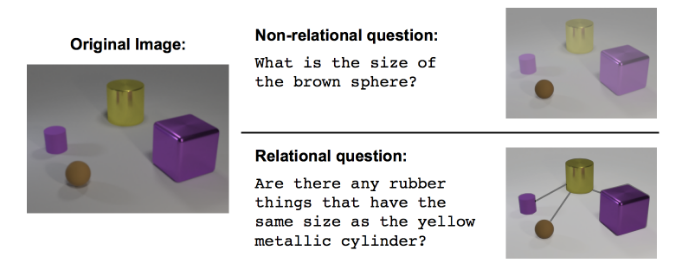
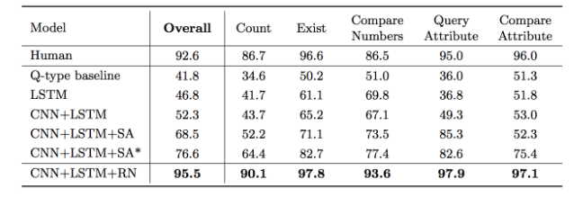
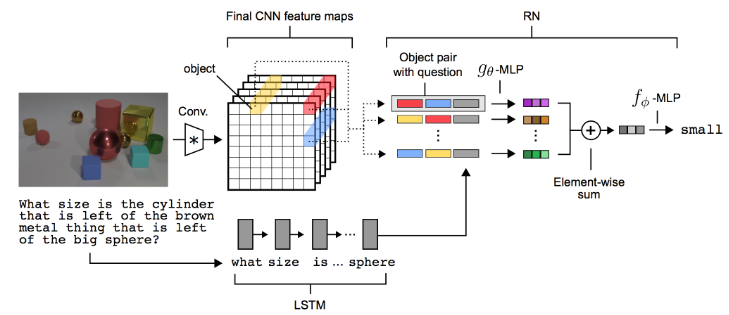

# A simple neural network module for relational reasoning

본 논문은 Visual QA 문제에서 **Relation Network(RN)**이라는 네트워크를 활용하여 object와 object의 속성 간의 관계를 추론할 수 있도록 DeepMind가 제안한 것이다. 예를 들어, 다음과 같이 relational question에 대한 답을 할 수 있다는 것이 특징이다.

### Relation Network

**RN**은 간단하고 다른 network architecture에도 쉽게 연동이 가능하다고 하며, 논문에서도 CNN과 LSTM과 결합하여 (RN-augmented architecture) 사용하였다. 

위의 결과에서 알 수 있듯이, 기존 모델은 76.6%인 반면에 **RN**을 적용하면 95.5%의 높은 성능을 보인다고 한다.

#### RN-augmented Visual QA architecture

본 논문에서 제안한 **RN**은 Visual QA 문제에 한정된 것은 아니지만, 객체의 관계를 추론하는 것이 목적이기 때문에 CNN과 LSTM 등의 모델에서의 출력을 활용한다.

## References

* https://tykimos.github.io/Keras/2017/06/10/Relation_Network/?fbclid=IwAR2tn6EE4Uim_9UXlpgwwj-1crxKcCQsuNSoatEbEi99xfRfHWkkgxTQUXs