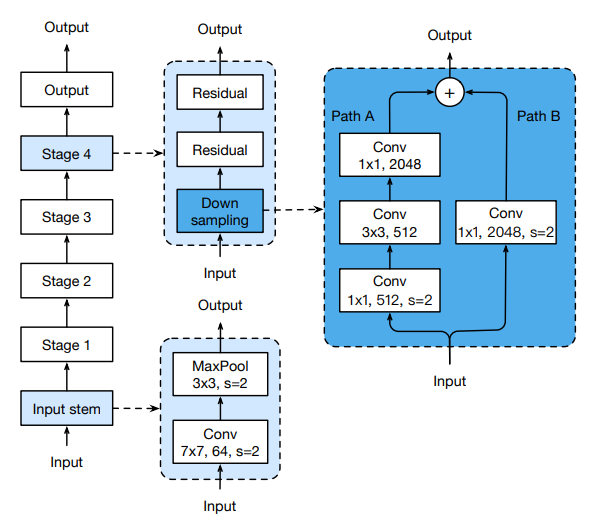
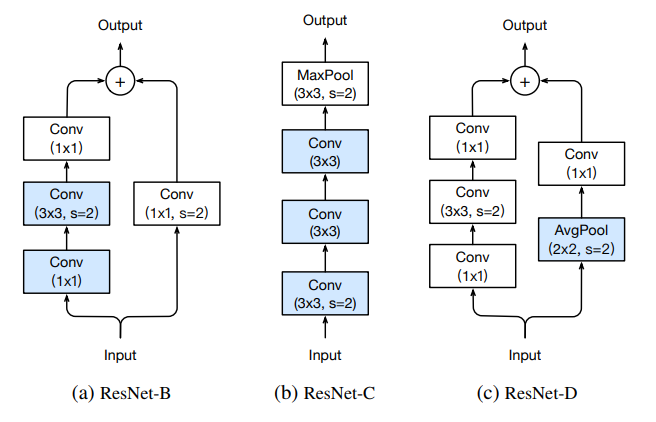
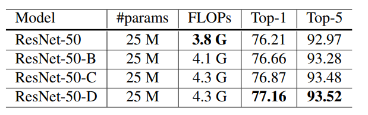
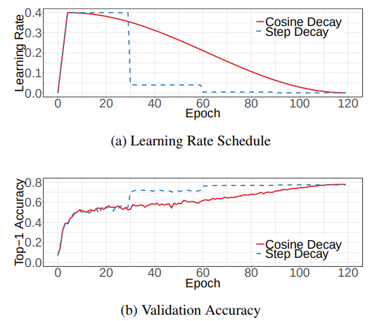

# Bag of Tricks for Image Classification with Convolutional Neural Networks

[paper link](https://arxiv.org/pdf/1812.01187.pdf)<br/>
본 논문은 Amazon Web Services에서 낸 것으로, classification의 성능을 개선하는 여러 가지 트릭(?)이나 기법들을 heuristic하게 정리하여 보여준다. 그리고 이는 classification뿐만 아니라 segmentaion, detection에도 도움이 된다.  

## 1. Abs. & Intro.

본 논문은 그 동안 image classification의 성능이 많이 향상되었지만, 이는 단순히 neural network architecture의 발전으로만 가능했던 것은 아니라고 제시한다. 그리고 아래와 같이 training procedure refinements와 같은 source code나 구현방법에 의해서 나타나는 여러 기법에 의해서 가능했던 것이며, 이를 체계적으로 ablation study로 증명한다. (물론, 주로 heuristic한 증명이다.)

**training procedure refinements**

* data augmentation methods
* optimization methods
* loss functions
* data preprocessing

**model architecture refinements**

* stride size
* learning rate schedule 

따라서, 위의 사항에 대해 여러 종류의 networks를 empirical evaluation한 것이며, 결과적으로 성능은 향상되었지만 연산량/연산시간은 늘어나지 않았다. 그리고 특정 network에 대해서는 generalization 성능이 향상되어 object segmetation과 semantic segmentation의 dataset에 대한 transfer learning의 성능도 향상됨을 보여준다.


## 2. Training Procedure

#### Baseline training procedure

1. Randomly sample an image and decode it into 32-bit floating point raw pixel values in [0, 255].
2. Randomly crop a rectangular region whose aspect ratio is randomly sampled in [3/4, 4/3] and area randomly sampled in [8%, 100%], then resize the cropped region into a 224-by-224 square image.
3. Flip horizontally with 0.5 probability.
4. Scale hue, saturation, and brightness with coefficients uniformly drawn from [0.6, 1.4].
5. Add PCA noise with a coefficient sampled from a normal distribution N(0, 0.1).
6. Normalize RGB channels by subtracting [123.68, 116.779, 103.939] and dividing by [58.393, 57.12, 57.375], respectively.

* 모델의 모든 layer(Conv, FC layer)의 weight는 Xavier Initialization으로 진행하고, Batch Normalization의 $\gamma$는 1로, $\beta$는 0으로 Initialization한다. 

> In particular, we set the parameter to random values uniformly drawn from [-a, a], where $a = \square{6/(d_{in} + d_{out})}$. Here, $d_{in}, d_{out}$은 input과 output의 channel size. 음,,, xavier initialization에서 uniform distr.으로 파라미터를 초기화하는 과정이 있는 듯?????????????????????????????

* Optimizer는 NAG(Nesterov Accelerated Gradient)을 사용한다.

* 학습환경은 8개의 GPU, Batch Size=256, 120 Epoch, Initial Learning Rate = 0.1(매 30, 60, 90번째 epoch마다 1/10을 해주는 Step Decay)


#### Baseline validation procedure

1. Resize each image's shorter edge to 256 pixels while keeping its aspect ratio.
2. Crop region into a 224-by-224.
3. Normalize RGB channels by subtracting [123.68, 116.779, 103.939] and dividing by [58.393, 57.12, 57.375], respectively.


## 3. Efficient Tranining

그간 GPU의 스펙이 많이 개선되어, lower numerical precision과 larger batch size로 학습시키는 것이 더 효율적이게 되었다. (model acc.의 감소없이) 즉, 속도와 정확도를 모두 개선시키는 것이 가능하다.

#### 3.1 Large batch training

학습에 있어서 batch size가 크면, 학습 결과는 좋지 못할 수 있다. 그렇기 때문에 convex problem에 있어서는 convergence rate는 batch size에 반비례한다. 다시 말해서, "동일한 epoch 동안 batch size가 더 큰 경우, validation accuracy가 batch size가 작은 경우보다 더 작다"고 heuristics에 의한 많은 논문에서 제시한바가 있다고 한다. 

1. Linear scaling learning rate

mini-batch SGD에서 gradient descending은 각각의 batch에서 학습되는 data는 randomly sampling되기 때문에 사실상 random process라고 할 수 있다. 

> Increasing the batch size does not change the expectation of the stochastic gradient but reduces its variance. 에서 expectation of the stochastic gradient란???????

그리고 batch size를 늘리는 것은 stochastic gradient의 variance를 줄일 수 있고, 이는 gradient의 noise를 줄이는 것과 동일하므로, learning rate를 크게 할 수 있는 이점을 줄 수 있다. 

어떤 논문에서는 learning rate를 batch size의 크기에 정비례하는 실험을 통해 증명하였다.

> 학습 과정에서 learning rate를 변화하는 것은 일반적인데, batch size를 변화시킬 수 있는가? 변화시켜도 되는가??????????????????/

예를 들어, learning rate를 0.1로 시작하여 batch size를 256으로 한다면, batch size를 더 큰 b로 바꾼다면, 초기 learning rate는 0$.1\times b/256$이 된다.


2. Learning rate warmup

초기 몇 epoch 또는 batch 동안 매우 작은 learning rate(=~ 0)로 시작하여 initial learning rate로 증가시키는 과정을 의미한다. (어떤 논문은 linear하게 증가시킴)

```
assume we will use the first $m$ batches (e.g. 5 data epochs) to warm up, and the
initial learning rate is $\eta$, then at batch $i$, $1 ≤ i ≤ m$, we will set the learning rate to be $i\eta/m$.
```

3. Zero

residual block을 사용하는 network의 경우, 이 residual block 이후에 오는 batch normalization layer의 파라미터인 $\gamma$를 모두 0으로 초기화하여 사용한다. (본래는 $\gamma$ = 1, $\beta$ = 0으로 초기화) 
```
Therefore, all residual blocks just return their inputs, mimics network that has less number of layers and is easier to train at the initial stage.
```

4. No bias decay

weight decay는 때때로 모든 학습가능한 파라미터(weight와 bias 모두 포함)에 대해서 적용되며, 이는 L2 regularlization을 모든 파라미터에 대해서 적용한 것과 같은 효과이다. 그리고 이 regularization을 weight에만 적용시키는 것이 overfitting을 예방하는 데에 더 효과적이라고 한다. 즉, CNN과 FC의 layer에 대한 weight에만 decay가 되고, 다른 bias, $\gamma$, $\beta$ 등은 decay가 되지 않도록 한다.

> Note that [LARS](https://openreview.net/pdf?id=rJ4uaX2aW) offers layer-wise adaptive learning rate and is reported to be effective for extremely large batch sizes (beyond 16K). layer-wise adaptive learning rate???

#### 3.2 Low-precision training

FP32보다 FP16으로 하면 학습 속도가 2 ~ 3배 정도 빨라진다. 하지만, 학습 결과에 대해서는 불리함을 가져올 수도 있다.

> 음,, 하드웨어적인 부분은 잘 몰라서 대충 읽었는데,,,

## 4. Model Tweaks

#### 4.1 ResNet architecture



#### 4.2 RseNet tweaks



위의 구조들은 resnet에서 downsampling block에 대해 변화를 준 것들이다. 

#### ResNet-B
이는 pytorch에서 제공하는 resnet model으로 기존의 4.1에서 보여주는 resnet의 downsampling block에서 path-A를 바꾼 것이다. 

> The observation is that the convolution in path A ignores three-quarters of the input feature map because it uses a kernel size 1×1 with a stride of 2. 라는 데 3/4이나 무시한다고???? 잘 이해 안감....

kernel size 1x1 with a stride of 2의 CNN은 input feature map의 3/4를 무시하는 것이기 때문에 ResNet-B는 kernel size 1x1의 CNN과 kernel size 3x3 with a stride of 2의 CNN으로 수정하여 정보의 손실을 없앴다고 한다. 이는 두 번째 CNN의 kernel size가 3x3이기 떄문에 path A의 결과물의 크기가 변하지 않아서 라고 한다.

> 흠,,, 왜지?? 왜 정보 손실이 없지? 그리고 3x3인데 크기가 변하지 않는다고? 줄어들지 않나?

#### ResNet-C
이는 Inception-v2에서 사용된 구조로서, SENet, PSPNet, DeepLabV3, ShuffleNetV2에서도 사용되었다. 

```
The observation is that the computational cost of a convolution is quadratic
to the kernel width or height. A 7 × 7 convolution is 5.4 times more expensive than a 3 × 3 convolution. So this tweak replacing the 7 × 7 convolution in the input stem
with three conservative 3 × 3 convolutions with the first and second convolutions have their output channel of 32 and a stride of 2, while the last convolution uses a 64 output channel.
```

#### ResNet-D

```
Inspired by ResNet-B, we note that the 1 × 1 convolution in the path B of the downsampling block also ignores 3/4 of input feature maps, we would like to modify
it so no information will be ignored. Empirically, we found adding a 2×2 average pooling layer with a stride of 2 before the convolution, whose stride is changed to 1, works well in practice and impacts the computational cost little. This tweak is illustrated in Figure 2c.
```



```
We evaluate ResNet-50 with the three tweaks and settings
described in Section 3, namely the batch size is 1024
and precision is FP16. The results are shown in Table 5.
Suggested by the results, ResNet-B receives more information
in path A of the downsampling blocks and improves
validation accuracy by around 0.5% compared to ResNet50.
Replacing the 7 × 7 convolution with three 3 × 3 ones
gives another 0.2% improvement. Taking more information
in path B of the downsampling blocks improves the validation accuracy by another 0.3%. In total, ResNet-50-D
improves ResNet-50 by 1%.
On the other hand, these four models have the same
model size. ResNet-D has the largest computational cost,
but its difference compared to ResNet-50 is within 15% in
terms of floating point operations. In practice, we observed
ResNet-50-D is only 3% slower in training throughput compared
to ResNet-50.
```

## 5. Training Refinements

#### 5.1 Cosine Learning Rate Decay

앞서 설명한 learning rate warmup을 한 이후에 cosine learning rate decay를 통해 learning rate를 서서히 감소시키는 방법이다. 이는 다음과 같은 식으로 수행된다.

$$ \eta_t = \frac{1}{2}(1 + cos(\frac{t\phi}{T}))\eta $$



#### 5.2 Label Smoothing

일반적인 classification의 output은 softmax를 통해서 다음과 같이 계산된다.

$$ q_i = \frac{exp(z_i)}{\sum^K_{j=i} exp(z_j)} $$

그리고 이에 정답 레이블의 경우 one-hot vector를 사용하여, 정답인 경우에는 1, 아닌 경우에는 0으로 구성된다. 그리고 loss는 다음과 같이 negative cross entropy를 사용한다.

$$ l(p, q) = - \sum^K_{i=1} q_i logp_i $$

이를 통해 예측분포와 정답분포를 일치시키면서 학습을 진행한다. 

$$ l(p, q) = − log p_y $$
$$ = -log(\frac{exp(z_y)}{\sum_{j=1}^K exp(z_j)}) $$
$$ = -log(exp(z_y) - log(\frac{1}{\sum_{j=1}^K exp(z_j)}) $$
$$ = -z_y + log({\sum_{j=1}^K exp(z_j)}) $$

이고, $p_y = 1$인 경우가 최적이므로, 

$$ z_y^* = inf $$ 

즉, 위와 같은 일반적인 classification의 경우 정답과 정답이 아닌 경우의 확률 차이가 dramatically distinctive하기 때문에 overfitting을 야기시킨다.

그러므로 이 차이를 smoothing하는 것이 label smoothing 기법이고, Inception-v2에서 다음과 같이 제안하였다.

$$
\begin{align}
q_i = \left\{
\begin{array}{cl}
\1 - \epsilon & if i = y, \\
\epsilon/(K - 1) & otherwise,
\end{array}
\right.
\end{align}
$$


$$
\begin{align}
z^*_i = \left\{
\begin{array}{cl}
\log((K - 1)(1 - \epsilon)/\epsilon) + \alpha & if i = y, \\
\alpha & otherwise,
\end{array}
\right.
\end{align}
$$

> 왜 최적해가 저렇게 될까!?!??!?!?!?!?!?!?!?!??!?!?!?!?!?!?!?!?

이 때, $\alpha$는 arbitrary real number이다. 결과적으로 이를 통해서 finite output을 fc로부터 도출하고, 이는 일반화에도 효과가 있다. 

```
This encourages a finite output from the fully-connected layer and can
generalize better
```

그리고 
```
When $ε = 0$, the gap $log((K − 1)(1 − ε)/ε)$ will be
∞ and as ε increases, the gap decreases. Specifically when
ε = (K − 1)/K, all optimal z
∗
i will be identical. 

```