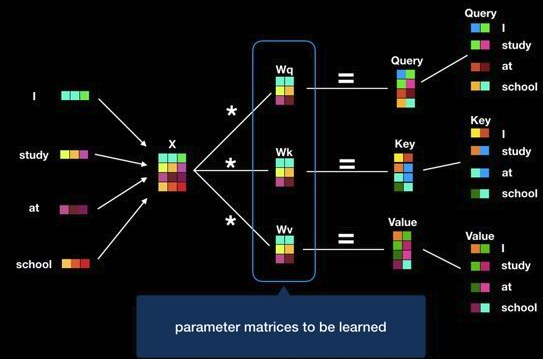
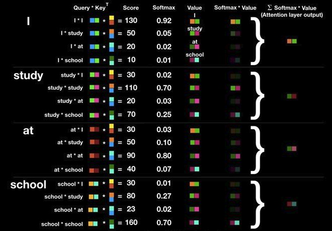
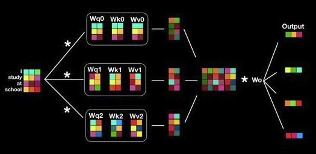
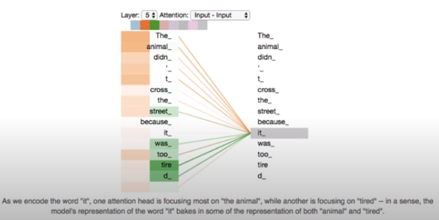
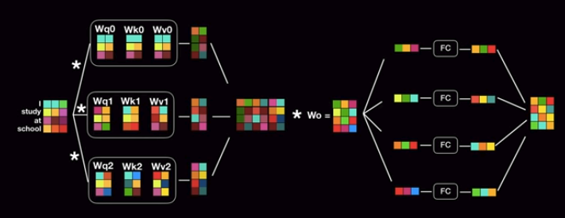

# Attention is all you need

기존에는 기계번역에 있어서 언어의 문맥상 순차적으로 이를 분석하고 해석하고자 RNN 계열의 encoder, decoder를 활용하였지만, 이는 문장의 구조를 순차적으로 모두 처리해야한다는 점에서 속도가 느리다고 할 수 있다. 그리고 transformer는 RNN을 제거하고, 이를 병렬적으로 처리하는 네트워크 구조를 설계함으로서 해결하였다.

#### Positional encoding
문장을 해석하는 데에 있어서 문장의 순서는 매우 중요하며, 이러한 점을 고려하여 고안된 방법이 positional encoding이고, 이는 encoder와 decoder의 입력값에 더해주는 operation을 통해서 반영된다.

그리고 본 논문에서는 sine과 cosine 함수를 활용하여 이 positional encoding을 구성하며, 다음과 같은 이점을 갖는다.

* positional encoding의 각각의 요소는 [-1, 1]의 값을 갖는다.
* 학습 데이터 중 가장 긴 문장보다 더 긴 문장이 inference에 들어오더라도 문제없이 상대적인 positional encoding을 적용할 수 있다. (이는 모든 positional encoding의 특징)

#### Self attention

Encoder내에서 이루어지는 attention mechanism을 의미한다.

* query (현재 단어)
* key
* val

#### Multi-head attention

https://jalammar.github.io/illustrated-transformer/

#### Encoder

### References
1. https://www.youtube.com/watch?v=mxGCEWOxfe8&ab_channel=MinsukHeo%ED%97%88%EB%AF%BC%EC%84%9D